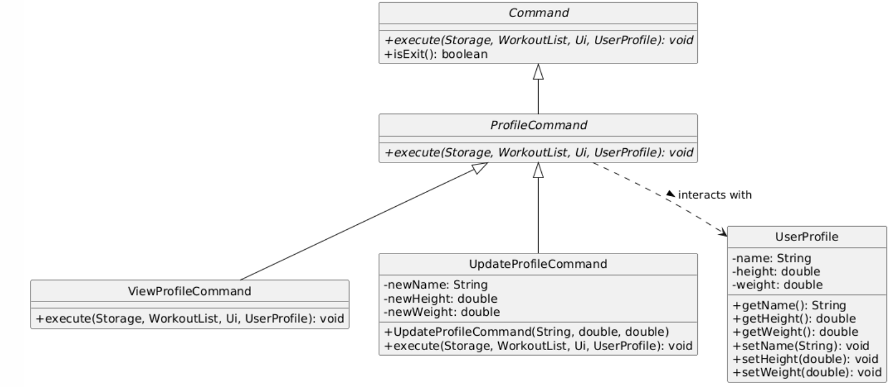

# Developer Guide

## Acknowledgements

{list here sources of all reused/adapted ideas, code, documentation, and third-party libraries -- include 
links to the original source as well}

## Design & implementation

### Enhancement 1: `EditCommand`

#### Purpose and user value

`EditCommand` lets users modify an existing workout entry without deleting and recreating it.
This reduces friction when correcting common input mistakes (for example, wrong distance, duration,
sets, reps, weight, name, or description) while preserving the original workout ordering.

Supported fields:
- For all workouts: `name`, `description`
- For run workouts: `distance`, `duration`
- For strength workouts: `weight`, `sets`, `reps`

Command format:

```
edit <index> <field>/<value>
```

Examples:
- `edit 1 distance/4.67`
- `edit 2 reps/10`
- `edit 3 name/Tempo Run`

#### Design overview

At the architecture level, this enhancement follows FitLogger's existing command pipeline:

1. `Parser.parse(...)` receives raw user input.
2. `Parser.parseEdit(...)` validates format and extracts the index, field, and value.
3. `Parser` returns an `EditCommand` as a `Command`.
4. The runtime invokes `Command.execute(storage, workouts, ui)` polymorphically.
5. `EditCommand` updates the selected `Workout` and reports the result through `Ui`.

Responsibilities remain clearly separated:
- Parser handles *syntax checking and tokenization*.
- Command handles *execution logic and field dispatch*.
- Workout classes enforce *domain invariants* through setter validation.

#### Component-level behavior

`EditCommand.execute(...)` performs the following steps:

1. Convert the user index from one-based to zero-based.
2. Validate bounds (`index >= 1 && index <= workouts.getSize()`).
3. Retrieve the target workout from `WorkoutList`.
4. Dispatch by field name using a switch statement.
5. Validate workout type compatibility for type-specific fields:
	- Reject `weight/sets/reps` for run workouts.
	- Reject `distance/duration` for strength workouts.
6. Parse numeric values for numeric fields.
7. Delegate final validation to domain setters.
8. Show a clear success or error message.

The command is intentionally defensive:
- Unknown fields are rejected (`Unknown editable field: ...`).
- Non-numeric numeric inputs are rejected.
- Invalid domain values are rejected via `FitLoggerException`.
- Name/description edits are validated against reserved storage delimiters (`|` and `/`) to 
prevent save-file corruption.

#### Data integrity and validation decisions

Key safeguards:

- **Delimiter safety**: edited names/descriptions are rejected when they contain reserved storage separators.
- **Finite numeric values**: `NaN` and `Infinity` are rejected for distance, duration, and weight.
- **Domain constraints**:
  - distance, duration > 0
  - weight >= 0
  - sets, reps > 0

These rules prevent invalid in-memory state and malformed persisted data.

#### Testing strategy

`EditCommandTest` covers both success and failure paths:

- Valid updates for run and strength workouts.
- Invalid index handling.
- Type mismatch handling (for example, lift-only fields on run workouts).
- Delimiter injection prevention for edited names.
- Rejection of non-finite numeric values (`NaN`, `Infinity`).

This verifies robust behavior under realistic user mistakes and malformed input.

#### Example usage scenario

Given below is an example scenario of how `EditCommand` is processed.

**Step 1.** The user enters an edit command, for example `edit 2 reps/10`.

**Step 2.** `Parser.parse(...)` routes the input to `Parser.parseEdit(...)`, which validates the command format and
extracts the index, field, and value.

**Step 3.** `Parser` returns an `EditCommand` object to the main execution loop.

**Step 4.** During `EditCommand.execute(storage, workouts, ui)`, the command validates index bounds, checks field
compatibility with workout type, and parses/validates the new value.

**Step 5.** The target workout is updated through setter methods, and a success message is printed. If any validation
fails, an error message is shown instead.

---

### Enhancement 2: `DeleteCommand`

#### Purpose and user value

`DeleteCommand` allows users to remove workouts by index or by name.
This supports both quick positional deletion and direct name-based deletion,
depending on whether users remember list order or workout name.

Supported formats:
- `delete <index>`
- `delete <workout_name>`

#### Design overview

The command is intentionally simple and cohesive:

1. Parser identifies the `delete` command and passes the raw argument string.
2. `DeleteCommand` stores only the user-supplied target text.
3. During execution, the command resolves the target as index-or-name.
4. If found, workout is removed from `WorkoutList`; otherwise, user sees not-found feedback.

This design keeps parsing and command behavior focused while preserving compatibility with the existing pipeline.

#### Component-level behavior

`DeleteCommand.execute(...)` performs:

1. Empty input check:
	- If blank, show usage guidance and return early.
2. Target resolution (`findWorkoutIndex(...)`):
	- First, attempt numeric parsing (`parseUserProvidedIndex`).
	- If numeric, convert one-based user index to zero-based list index.
	- If non-numeric, perform case-insensitive full-name match.
3. Deletion:
	- On match, delete the workout and show `Deleted workout: <name>`.
	- On miss, show `Workout not found: <input>`.

This approach avoids ambiguity and keeps deletion behavior predictable.

#### Edge cases handled

- Blank target text.
- Out-of-range numeric index (e.g., 0 or larger than current list size).
- Non-numeric text that does not match any workout name.
- Case-insensitive name matching for better usability.

#### Testing strategy

`DeleteCommandTest` verifies:

- Name-based deletion success.
- Index-based deletion success (one-based input behavior).
- Blank-input usage message.
- Not-found message for missing name.
- Not-found message for invalid numeric index.

This ensures both deletion flows (index and name) remain stable and regressions are caught early.

#### Example usage scenario

Given below is an example scenario of how `DeleteCommand` is processed.

**Step 1.** The user enters a delete command, for example `delete 3` or `delete Tempo Run`.

**Step 2.** `Parser.parse(...)` identifies the `delete` command and creates a `DeleteCommand` with the raw argument.

**Step 3.** In `DeleteCommand.execute(storage, workouts, ui)`, the command first checks for empty input.

**Step 4.** The command resolves the target by trying numeric index parsing first, then case-insensitive name matching
if parsing fails.

**Step 5.** If a target workout is found, it is removed from `WorkoutList` and the user sees a deletion confirmation.
If no target is found, the user sees a not-found message.

---

### Enhancement 3: `add-lift` Command and `StrengthWorkout`

#### Purpose and user value

The `add-lift` command allows users to log strength-based exercises directly from the CLI.
It captures four fields: exercise name, weight lifted in kilograms, number of sets, and
number of repetitions. This separates strength tracking from run tracking, giving users
a dedicated and validated logging path for gym workouts.

Command format:
```
add-lift <name> w/<weightKg> s/<sets> r/<reps>
```

Examples:
- `add-lift Bench Press w/80 s/3 r/8`
- `add-lift Squat w/100 s/5 r/5`
- `add-lift Pull-up w/0 s/3 r/10`

#### Design overview

This feature follows FitLogger's existing command pipeline:

1. `Parser.parse(...)` identifies the `add-lift` keyword and routes input to
   `Parser.parseAddLift(...)`.
2. `parseAddLift(...)` validates the input format, extracts the name and numeric fields,
   and constructs a `StrengthWorkout` object.
3. The `StrengthWorkout` is wrapped in an `AddWorkoutCommand` and returned to the main loop.
4. The main loop calls `Command.execute(storage, workouts, ui)` polymorphically.
5. `AddWorkoutCommand` adds the workout to `WorkoutList` and prints a confirmation via `Ui`.

Responsibilities remain clearly separated:
- `Parser` handles syntax validation and tokenization.
- `AddWorkoutCommand` handles execution logic and list mutation.
- `StrengthWorkout` enforces domain invariants through setter validation.

#### Class-level design

The class diagram below shows the inheritance structure underpinning this feature.


`StrengthWorkout` extends the abstract `Workout` base class, which also serves as the
parent for `RunWorkout`. This polymorphic design allows `WorkoutList` to store both types
under a single `ArrayList<Workout>` without needing separate lists. `AddWorkoutCommand`
holds a reference to the abstract `Workout` type, meaning the same command class handles
both `add-lift` and `add-run` — no separate `AddLiftCommand` class is needed.

#### Sequence of events

The sequence diagram below shows how a lift is logged when the user enters
`add-lift Bench w/80 s/3 r/8`.


The `StrengthWorkout` object is created inline during parsing and passed directly into
`AddWorkoutCommand`. The command does not store a reference to `Parser` or `Storage` —
it receives `storage` and `workouts` only at execution time via `execute(...)`, keeping
the command stateless until it runs.

#### Component-level behavior

`Parser.parseAddLift(...)` performs the following steps:

1. Check that arguments are not blank; throw `FitLoggerException` with usage hint if so.
2. Split the argument string on the `w/`, `s/`, and `r/` flag markers using
   `splitInput(arguments, "w/|s/|r/", 4)`.
3. Validate that exactly four parts were produced (name + three numeric fields).
4. Validate the exercise name against reserved storage delimiters (`|` and `/`).
5. Parse `weight` as a `double`, `sets` and `reps` as `int`; throw on parse failure.
6. Apply domain constraints: weight >= 0, sets > 0, reps > 0.
7. Construct and return `new AddWorkoutCommand(new StrengthWorkout(...))`.

`AddWorkoutCommand.execute(...)` performs:

1. Call `workouts.addWorkout(workoutToAdd)`.
2. Print confirmation via `ui.showMessage(...)` and `ui.printWorkout(...)`.

#### Storage format

A logged lift is persisted to `data/fitlogger.txt` in the following format:
```
L | <description> | <date> | <weight> | <sets> | <reps>
```

For example:
```
L | Bench Press | 2026-03-21 | 80.0 | 3 | 8
```

The `L` type prefix allows `Storage.loadData()` to distinguish lift entries from run
entries (`R`) when reconstructing the workout list on startup. Each field is pipe-separated
and positionally indexed, matching the index constants defined in `Storage`.

#### Editing a logged lift

After logging a lift, users can correct any field using `EditCommand`:
```
edit <index> weight/<value>
edit <index> sets/<value>
edit <index> reps/<value>
edit <index> name/<value>
```

`EditCommand` checks that the target workout is a `StrengthWorkout` instance before
applying weight, sets, or reps edits, and rejects those fields for run workouts. This
type-checking is done via `instanceof` in the dispatch switch. See Enhancement 1 for
the full `EditCommand` design.

#### Validation and error handling

| Input error | Error message shown |
|---|---|
| Missing arguments | `Missing arguments for add-lift.` + usage hint |
| Missing flag (e.g. no `r/`) | `Invalid format for add-lift.` + usage hint |
| Non-numeric weight/sets/reps | `Weight must be a decimal number; sets and reps must be integers.` |
| Negative weight | `Weight cannot be negative.` |
| Zero or negative sets | `Sets must be a positive integer.` |
| Zero or negative reps | `Reps must be a positive integer.` |
| Name contains `\|` or `/` | `Exercise name must not contain '\|' or '/'` |

#### Design considerations

**Alternative 1 (current choice): Inheritance — `StrengthWorkout extends Workout`**

- Pros: Each subclass stores only the fields it needs. `WorkoutList` holds both types
  via polymorphism. `AddWorkoutCommand` is reused without modification. Adding a new
  workout type (e.g. cycling) only requires a new subclass.
- Cons: Type-specific operations in `EditCommand` require `instanceof` checks, which
  is a mild violation of the open-closed principle.

**Alternative 2: Single `Workout` class with all fields**

- Pros: Simpler class hierarchy, no casting needed.
- Cons: Every workout carries unused fields (e.g. a run entry storing `weight = 0`,
  `sets = 0`, `reps = 0`). This wastes memory and becomes harder to maintain as more
  workout types are added. Validation also becomes messier since the class cannot
  enforce which fields are required for which workout type.

Inheritance was chosen because it scales better as the app grows and keeps each class
focused on a single workout type.

---

### Enhancement 4: `RunWorkout`

#### Purpose and user value

`RunWorkout` represents a running workout entry in FitLogger. It extends the abstract 
`Workout` base class and adds two run-specific fields: distance (in kilometres) and 
duration (in minutes). This gives users a dedicated, validated data model for tracking
their runs separately from strength workouts.

Command format:

```
add-run <description> d/<distance> t/<durationMinutes>
```

Examples:

- `add-run Morning Jog d/5.0 t/30`
- `add-run Tempo Run d/10.5 t/55.5`

#### Design overview

`RunWorkout` sits at the data layer of FitLogger's architecture. It is constructed by `Parser.parseAddRun(...)` and 
passed into `AddWorkoutCommand`, following the same pipeline as `StrengthWorkout`:

1. `Parser.parse(...)` identifies the `add-run` keyword and routes input to `Parser.parseAddRun(...)`.
2. `parseAddRun(...)` validates the format, extracts the name and numeric fields, 
and constructs a `RunWorkout` object.
3. The `RunWorkout` is wrapped in an `AddWorkoutCommand` and returned to the main loop.
4. `AddWorkoutCommand.execute(...)` adds the workout to `WorkoutList` and confirms via `Ui`.

#### Class-level design

`RunWorkout` extends the same abstract `Workout` base class as `StrengthWorkout`. 
This polymorphic design allows `WorkoutList` to store both types in a single `ArrayList<Workout>`. 
Domain validation is enforced directly in the setters, keeping invalid state from ever being stored.

The two run-specific fields and their constraints are:

|Field|Type|Constraint|
|---|---|---|
|`distance`|`double`|Must be finite and > 0|
|`durationMinutes`|`double`|Must be finite and > 0|

#### Storage format

A logged run is persisted to `data/fitlogger.txt` in the following format:

```
R | <description> | <date> | <distance> | <durationMinutes>
```

For example:

```
R | Morning Jog | 2026-03-27 | 5.0 | 30.0
```

The `R` type prefix allows `Storage.loadData()` to distinguish run entries from lift entries (`L`) when 
reconstructing the workout list on startup.

#### Validation and error handling

Validation is split between `Parser.parseAddRun(...)` (format-level) and `RunWorkout` setters (domain-level):

|Input error|Error message shown|
|---|---|
|Missing arguments|`Missing arguments for add-run.` + usage hint|
|Missing flag (e.g. no `d/`)|`Invalid format for add-run.` + usage hint|
|Non-numeric distance/duration|Parse error with usage hint|
|Zero or negative distance|`Distance must be a positive number.`|
|Zero or negative duration|`Duration must be a positive number.`|
|Non-finite value (`NaN`, `Infinity`)|`Distance must be a positive number.` / `Duration must be a positive number.`|

#### Design considerations

**Alternative 1 (current choice): Setters with validation in `RunWorkout`**

- Pros: Domain rules are enforced at the source. Invalid state cannot exist in a `RunWorkout` 
object at any point after construction. Setters are reused by `EditCommand` without duplicating validation logic.
- Cons: Checked exceptions from setters must be handled at every call site (constructor and `EditCommand`).

**Alternative 2: Validate only in `Parser`**

- Pros: Simpler class design with no exceptions thrown from setters.
- Cons: Validation logic is duplicated or bypassed if `RunWorkout` is ever constructed outside of `Parser`. 
This breaks encapsulation and makes the domain model unreliable.

Setter-level validation was chosen to ensure the domain model is always self-consistent, 
regardless of how it is constructed.

---

### Enhancement 5: `ViewShoeMileageCommand`

#### Purpose and user value

`ViewShoeMileageCommand` lets users see their total running distance across all logged run workouts, 
along with a count of how many runs they have completed. This gives runners a quick summary of their 
accumulated shoe mileage — a common metric for knowing when to replace running shoes.

Command format:

```
view-total-mileage
```

Example output:

```
Your total distance ran is 45.30km across 7 runs.
```

#### Design overview

This command follows FitLogger's standard command pipeline. It holds no user-supplied state 
and requires no arguments — it is a pure read operation over `WorkoutList`.

1. `Parser.parse(...)` identifies the `view-total-mileage` keyword and returns a `ViewShoeMileageCommand`.
2. The main loop calls `execute(storage, workouts, ui)`.
3. The command iterates over all workouts, filters for `RunWorkout` instances, and accumulates the total distance.
4. The result is displayed via `Ui`.

#### Component-level behavior

`ViewShoeMileageCommand.execute(...)` performs the following steps:

1. Initialise `totalMileage = 0.0` and `runWorkoutCount = 0`.
2. Retrieve all workouts from `WorkoutList` via `getWorkouts()`.
3. For each workout, check if it is an instance of `RunWorkout` using a pattern-matching `instanceof`.
4. If so, assert that `distance >= 0` (a defensive sanity check), then accumulate distance and increment the count.
5. Display the formatted result via `ui.showMessage(...)`.

The command is deliberately read-only: it does not modify `WorkoutList`, `Storage`, or `UserProfile`.

#### Design considerations

**Alternative 1 (current choice): Filter by `instanceof` in the command**

- Pros: Simple and self-contained. No changes needed to `WorkoutList` or `Workout`. 
Easily extended to show per-workout breakdowns in the future.
- Cons: The command is aware of a concrete subtype (`RunWorkout`), which is a mild coupling to the class hierarchy.

**Alternative 2: Add a `getTotalRunDistance()` method to `WorkoutList`**

- Pros: Encapsulates the filtering logic inside `WorkoutList`, making the command even simpler.
- Cons: Adds a run-specific method to `WorkoutList`, which should ideally remain type-agnostic. 
As more workout types are added, this approach leads to a proliferation of 
type-specific query methods on `WorkoutList`.

The current approach was chosen to keep `WorkoutList` general-purpose while accepting the 
minor coupling in the command itself.

---

### Enhancement 6: `ViewProfileCommand` and `UpdateProfileCommand`

#### Purpose and user value

These two commands give users a persistent identity within FitLogger by managing a `UserProfile` 
that stores their name, height, and weight.

- `ViewProfileCommand` displays the current profile, with friendly placeholder text for any fields not yet set.
- `UpdateProfileCommand` allows users to update a profile field in a single command.

Command formats:

```
profile view
profile set name <name>
profile set height <metres>
profile set weight <kg>
```

#### Design overview

Both commands extend `ProfileCommand`, which itself extends the abstract `Command` base class. 
This intermediate layer groups profile-related commands without adding any behaviour — 
it serves as a marker for future extensibility (for example, a `DeleteProfileCommand`).

The execution flow is:

1. `Parser.parse(...)` identifies the `profile` keyword and routes to sub-parsers for `view` or `set`.
2. For `profile view`, a `ViewProfileCommand` is returned with no arguments.
3. For `profile set`, `Parser` extracts whichever fields are present and constructs an `UpdateProfileCommand` 
with the parsed values. Fields not present in the input are passed as `null` (name) or `-1` (height/weight)
to signal "no change".
4. The main loop calls `execute(storage, workouts, ui, profile)` polymorphically.

#### Class-level design

The class diagram below shows the inheritance structure underpinning this feature.



Both `ViewProfileCommand` and `UpdateProfileCommand` inherit from the abstract `ProfileCommand`, 
which in turn extends the base `Command` class. This tiered inheritance allows the application to 
categorize profile-specific actions under a common parent.

The `UserProfile` class acts as the data store for the user's physical attributes. 
During execution, the `ProfileCommand` interacts directly with the `UserProfile` object passed 
into its `execute` method. This design ensures that profile data is decoupled from the workout list, 
maintaining a clean separation of concerns within the application state.

#### Component-level behavior

**`ViewProfileCommand.execute(...)`**

1. Call `ui.showLine()` to open the display block.
2. Display name — if `profile.getName()` is `null`, show `"name not set yet"`.
3. Display height — if `profile.getHeight()` is `-1`, show `"height not set yet"`; 
otherwise format to 2 decimal places with the `m` suffix.
4. Display weight — if `profile.getWeight()` is `-1`, show `"weight not set yet"`; 
5. otherwise format to 2 decimal places with the `kg` suffix.
Call `ui.showLine()` to close the display block.

**`UpdateProfileCommand.execute(...)`**

1. If `newName != null`, call `profile.setName(newName)` and confirm via `Ui`.
2. If `newHeight != -1`, call `profile.setHeight(newHeight)` and confirm via `Ui`.
3. If `newWeight != -1`, call `profile.setWeight(newWeight)` and confirm via `Ui`.

Only fields explicitly supplied by the user are updated. Fields passed as sentinel values 
(`null` / `-1`) are silently skipped, preserving existing profile data.

#### Sentinel value design decision

`-1` is used as a sentinel for unset numeric profile fields (height and weight) because:

- It is outside any valid physical range, so it cannot be confused with a real value.
- The same sentinel is used consistently in both `UserProfile` storage and `UpdateProfileCommand` 
argument passing, keeping the contract clear.

An assertion in `UpdateProfileCommand`'s constructor enforces this:

java

``` java
assert newHeight == -1 || newHeight >= 0 : "Height is invalid";
assert newWeight == -1 || newWeight >= 0 : "Weight is invalid";
```

#### Design considerations

**Alternative 1 (current choice): Separate `ViewProfileCommand` and `UpdateProfileCommand`**

- Pros: Each command has a single responsibility. `ViewProfileCommand` is always a safe read-only 
operation. Adding a new profile sub-command in the future (e.g. `profile reset`) only requires a new subclass.
- Cons: Slightly more classes to maintain.

**Alternative 2: Single `ProfileCommand` that handles both `view` and `set`**

- Pros: Fewer classes.
- Cons: The command must carry a mode flag and branch internally, mixing read and write logic in 
one class. This reduces clarity and makes testing harder.

Separate commands were chosen to preserve single responsibility and keep each command easy to 
test and extend independently.

---

### Notes for team writeups

### Command Architecture

The execution logic of **FitLogger** is centered around the **Command Pattern**. This architectural 
choice decouples the object that invokes an operation (the main execution loop in `FitLogger`) from the 
objects that actually perform the action.

#### Design Rationale
By encapsulating a request as an object, the system achieves several key design goals:
* **Separation of Concerns:** The `FitLogger` main class does not need to know the 
internal logic of specific features; it only needs to call a uniform `execute()` method.
* **Extensibility:** Adding new features (e.g., `edit-run`) only requires creating a new 
subclass of `Command` and updating the `Parser`, leaving the core execution loop untouched.
* **Uniform Error Handling:** Since all commands follow the same interface, exceptions thrown 
during execution (like `FitLoggerException`) can be caught and handled globally by the main loop.

#### Components and Interaction
The Command architecture consists of three primary elements:
1.  **`Command` (Abstract Class):** The base template for all actions. It defines the 
`execute(Storage, WorkoutList, Ui)` method, ensuring every command has access to the necessary system components.
2.  **Concrete Implementations:** Subclasses like `AddWorkoutCommand` 
and `DeleteCommand` store specific user-inputted states—such as a `Workout` 
object or a name `String`—internally until execution.
3.  **Polymorphic Execution:** The `FitLogger#run()` method maintains a 
"Parse-then-Execute" loop. It treats all returned objects as the abstract `Command` 
type, invoking `isExit()` to determine if the application should terminate.

Unlike "ready-to-run" implementations, FitLogger's commands are **stateless regarding the system** 
but **stateful regarding user input**. They are instantiated with arguments by the `Parser` but only gain 
access to application data (`WorkoutList`) and persistence (`Storage`) at the moment of execution.


---

### Parser Implementation

The `Parser` component is a static utility class responsible for transforming raw user input strings into the 
executable `Command` objects described above.

#### Execution Logic
The parsing logic is centralized in the `Parser#parse()` method, following a two-stage process:
1.  **Tokenization:** The input string is split into a `commandWord` and `arguments` using the `splitInput` 
helper method.
**Command Dispatch:** A `switch` block routes the `commandWord` to the appropriate command constructor 
2. (e.g., `DeleteCommand`, `ExitCommand`) or specialized sub-parser methods (e.g., `parseAddRun`, `parseAddLift`).

The following sequence diagram illustrates the internal logic of the `Parser` when handling `add-run` or 
`delete` commands:


---

### Design Considerations

**Aspect: Class Structure**
* **Current Implementation:** Static utility class.
    * **Pros:** Simple to use across the application without maintaining state; lightweight for the current scope.
    * **Cons:** Harder to "mock" during unit testing compared to an instance-based approach.
* **Alternative Considered:** Instance-based Parser with Dependency Injection.
    * **Reason for Rejection:** Given the current requirements of FitLogger, a static parser is sufficient 
  and avoids unnecessary complexity.

**Aspect: Data Validation**
* The parser acts as a gatekeeper for data integrity. It ensures that user-inputted text (like workout names) 
does not contain reserved characters (`|` or `/`) used by the `Storage` component. This prevents potential 
file corruption during save/load operations.

## Product scope
### Target user profile

{Describe the target user profile}

### Value proposition

{Describe the value proposition: what problem does it solve?}

## User Stories

|Version| As a ... | I want to ... | So that I can ...|
|--------|----------|---------------|------------------|
|v1.0|new user|see usage instructions|refer to them when I forget how to use the application|
|v2.0|user|find a to-do item by name|locate a to-do without having to go through the entire list|

## Non-Functional Requirements

{Give non-functional requirements}

## Glossary

* *glossary item* - Definition

## Instructions for manual testing

{Give instructions on how to do a manual product testing e.g., how to load sample data to be used for testing}
